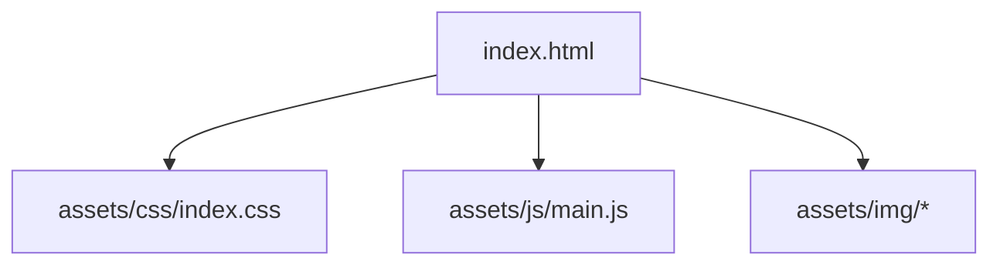

<!-- prettier-ignore-start -->

## 📋 Table of Contents
{: .no_toc }

- TOC
{:toc}

<!-- prettier-ignore-end -->

## 🎯 Session Objectives

- Understand the basic structure of a modern web project.
- Identify the function of each folder and file in the initial template.
- Learn best practices for file and resource organization.
- Become familiar with using reliable references like MDN.
- Prepare the environment to start developing accessible and well-structured web pages.

## 🔹 Reminder: HTML5 as the current standard

HTML5 is the most recent and standardized version of the HTML markup language. It defines the structure and content of web pages in a more efficient, flexible, and accessible way. **All practices in this course are aligned with the official HTML5 specification:**

🔗 **HTML5 Specification – WHATWG**: [https://html.spec.whatwg.org/](https://html.spec.whatwg.org/)

---

## 🔹 Previous note: Why do we use MDN as a reference?

In this course, we will use **MDN Web Docs** as the main reference for HTML, CSS, and JavaScript. **MDN (Mozilla Developer Network)** is one of the most reliable sources for web developers, as:

👉 It is maintained by **Mozilla**, a non-profit organization that promotes open standards.  
👉 It is constantly updated with best practices and browser compatibility.  
👉 It provides clear documentation, examples, and detailed explanations.

🔗 **Key references:**

- **HTML basics – MDN**: [https://developer.mozilla.org/en-US/docs/Web/HTML](https://developer.mozilla.org/en-US/docs/Web/HTML)
- **CSS – MDN**: [https://developer.mozilla.org/en-US/docs/Web/CSS](https://developer.mozilla.org/en-US/docs/Web/CSS)
- **Meta tags SEO – MDN**: [https://developer.mozilla.org/en-US/docs/Web/HTML/Element/meta](https://developer.mozilla.org/en-US/docs/Web/HTML/Element/meta)

---

## 📂 Student Project Template – Project Structure

A **pedagogical explanation** of the structure of the [`student-project-template`](https://github.com/ruvebal/web-atelier-udit/tree/main/student-project-template) template, designed so that your students understand **what is in each folder and file, and what it's for**.

This repository is a **common starting point**: each student clones or forks it, and from there develops their practices and deliverables.

---

### 🌳 Directory Tree (simplified)

```text
student-project-template/
├── assets/              # Project resources (styles, scripts, images)
│   ├── css/
│   │   └── index.css    # Base project stylesheet
│   ├── js/
│   │   └── main.js      # Main JavaScript (interactivity)
│   └── img/             # Folder for project images
│
├── index.html           # Main project page
├── project-brief.md     # Brief project description (instructions)
└── README.md            # Initial guide: how to use this repo
```

---

### 📖 File-by-File Explanation

#### 1. `index.html`

- **Function**: the main project page.
- Here you insert your content: titles, paragraphs, galleries, forms, etc.
- It's the **entry point** that the browser opens (and that _GitHub Pages_ shows by default).
- It's connected to the styles (`assets/css/index.css`) and the script (`assets/js/main.js`).

👉 Think of this file as the **semantic structure** of your web.

---

#### 2. `assets/css/index.css`

- **Function**: defines the **visual presentation**.
- Here you control typography, colors, margins, grid, responsive design…
- It loads from the `<head>` of `index.html`.

👉 It's the space to experiment with **modern styles**: _flexbox_, _grid_, _media queries_, `clamp()`, _container queries_…

---

#### 3. `assets/js/main.js`

- **Function**: adds **dynamism and interactivity**.
- Here we program behaviors like:

  - Show/hide a menu.
  - Animate elements when scrolling.
  - Validate a form.

👉 This will be the file where we do **DOM + events** exercises.

---

#### 4. `assets/img/`

- Folder dedicated to project images.
- **Good practice**: name files clearly (`hero.jpg`, `profile.png`, `logo.svg`).

👉 It's also the place where you'll save **screenshots** in practices like `resources.html`.

---

#### 5. `project-brief.md`

- Document with the **project assignment**.
- Defines objectives, context, and deliverables.
- Helps your repo function as a **narrated portfolio**.

👉 Here you can add personal notes from your creative process.

---

#### 6. `README.md`

- First reference of the repository.
- Explains **what this project is** and **how to run it** (for example with _VSCode Live Server_).
- Contact point for professors and colleagues who visit your repo.

👉 At a professional level, the `README` is the **business card** of your code.

---

### 🔗 Connection between files



- `index.html` calls the styles (`css`) and scripts (`js`).
- These files rely on resources (`img`).
- The whole set is documented in `README.md` and in the `project-brief.md`.

---

### 🧭 ATELIER Methodology

- **Observe**: Explore the template, open the files in _VSCode_, notice the connections.
- **Intervene**: Change a color in `index.css`, add a `console.log()` in `main.js`. See the immediate effect in the browser.
- **Reflect**: Write in the `project-brief.md` what you learned from each change.
- **Share**: Make a commit in your repo to document the progress.

---

## 🔹 2. HTML structure and value of `index.html`

💡 **The `index.html` file is key on the web** because it's the default file that loads when we visit a site without specifying a page (for example, `https://mydomain.com/`).

💡 **Likewise `index.html` is also the file that the web server will give as a default response when the directory containing it is requested. If `https://mydomain.com/mypage` is requested, it will resolve `https://mydomain.com/mypage/index.html`.**

🛠️ **Practical exercise:**

1. Open `index.html` and make some modification
2. You can use **Copilot** to complete the semantic structure of the page.
3. Save and view with **Live Server** in VSC.

## 3️⃣ Meta Tags for SEO

### 🔹 What is SEO and why is it important?

SEO (**Search Engine Optimization**) is a set of techniques to improve the visibility of a website in search engines like _Google_. **Meta tags** in HTML help search engines understand the content of a page and index it correctly.

### 🔹 Essential Meta Tags

Example of **basic meta tags** to improve SEO:

```html
<meta name="description" content="Learn HTML and web development with best practices." />
<meta name="keywords" content="HTML, CSS, web development, SEO, accessibility" />
<meta name="author" content="Your Name" />
<meta name="robots" content="index, follow" />
```

🔹 **Explanation of each meta tag:**

- **`description`** → Brief description of the page content. Appears in search results.
- **`keywords`** → Relevant keywords (no longer an important factor for _Google_, but still useful).
- **`author`** → Name of the content author.
- **`robots`** → Tells search engines whether to index and follow the page links.

🛠 **Practical exercise:**

1. Add these meta tags in `<head>`.
2. Use the **"Inspect" (F12) → Elements → Head"** tool to see if they're loading correctly.

🔗 **MDN - Meta Tags SEO**: [https://developer.mozilla.org/en-US/docs/Web/HTML/Element/meta](https://developer.mozilla.org/en-US/docs/Web/HTML/Element/meta)

---

## 4️⃣ The `<body>` and semantic structure

### 🔹 What is semantic HTML and why is it important?

**Semantic HTML** uses tags with meaning, making code more accessible, easier to understand, and better for SEO.

📌 **Tim Berners-Lee**, creator of the web, introduced the concept of **Semantic Web**, which seeks to structure content to be understandable by both humans and machines. In the words of W3C:

> _"The Semantic Web is about making links meaningful, enabling software agents to locate and understand information more effectively."_

### 🔹 Recommended semantic structure

Correct example of semantic HTML structure:

```html
<body>
	<header>
		<h1>My Web Page</h1>
		<nav>
			<ul>
				<li><a href="#">Home</a></li>
				<li><a href="#">Contact</a></li>
			</ul>
		</nav>
	</header>

	<main>
		<section>
			<h2>About Us</h2>
			<p>Welcome to our page.</p>
		</section>
	</main>

	<footer>
		<p>&copy; 2025 My Web</p>
	</footer>
</body>
```

🔹 **Explanation of each tag:**

- **`<header>`** → Main header with title and navigation.
- **`<nav>`** → Groups the site's navigation links.
- **`<main>`** → Main page content (there should only be one per document).
- **`<section>`** → Groups related content within the page.
- **`<footer>`** → Contains secondary information like copyright and additional links.

🔗 **MDN - Semantic HTML**: [https://developer.mozilla.org/en-US/docs/Glossary/Semantics](https://developer.mozilla.org/en-US/docs/Glossary/Semantics)

🔗 **MDN - Semantic web**: [https://developer.mozilla.org/en-US/curriculum/core/semantic-html/](https://developer.mozilla.org/en-US/curriculum/core/semantic-html/)

---

## 5️⃣ Multimedia Resource Insertion

### 📌 IMPORTANT Why not store large or binary files in _GitHub_?

**_GitHub_ is not designed to store large or binary files.**  
Main reasons:

- **Storage limits**: _GitHub_ limits file and repository size.
- **Performance issues**: Large files make `git pull` and `git clone` slower.
- **Recommended alternative**: Use a **CDN or external storage service** (example: _ImageKit.io_, _Cloudinary_, _Firebase Storage_).

### 📌 5.1 Load images and videos from local

Example with images inside `assets/images/`:

```html

```

Example with video in `assets/videos/`:

```html
<video controls>
	<source src="assets/videos/video.mp4" type="video/mp4" />
	Your browser does not support the video tag.
</video>
```

Example with audio in `assets/audios/`:

- **You'll need to make sure to add the assets/audios directory for the following example.**

```html
<audio controls>
	<source src="./assets/audios/example.mp3" type="audio/mp3" />
	Your browser does not support the audio tag.
</audio>
```

🛠 **Practical exercise:**

1. Upload an image to `assets/images/`.
2. Insert it in HTML with the `` tag.
3. Load a local video and test it in the browser.

🔗 **MDN - Images in HTML**: [https://developer.mozilla.org/en-US/docs/Web/HTML/Element/img](https://developer.mozilla.org/en-US/docs/Web/HTML/Element/img)  
🔗 **MDN - Video in HTML**: [https://developer.mozilla.org/en-US/docs/Web/HTML/Element/video](https://developer.mozilla.org/en-US/docs/Web/HTML/Element/video)

---

### 📌 5.2 Insert images via API (example: _ImageKit.io_)

To load optimized images from an external service:

```html

```

🛠 **Practical exercise:**

1. Create an account at **[https://imagekit.io/](https://imagekit.io/)**.
2. Upload an image and get the URL.
3. Insert it in HTML.

🔗 **MDN - Remote image loading**: [https://developer.mozilla.org/en-US/docs/Web/HTML/Element/img#attributes](https://developer.mozilla.org/en-US/docs/Web/HTML/Element/img#attributes)

---

## 📌 6: Create `css/index.css` with `@import` of `main.css` and a CSS Reset first

### 🎯 Objectives:

- Learn to properly structure CSS stylesheets by separating global and specific configurations.
- Ensure a uniform base across all browsers with a **CSS Reset**.

### 🛠 Method:

✅ Create a `css/index.css` file as the style entry point.  
✅ Use `@import` to link **a CSS Reset** before `main.css`, ensuring cross-browser coherence.  
✅ Use `@import` to link `main.css` and organize styles.  
✅ Ensure that `index.css` is correctly linked in the `<head>` of `index.html`.

### 📌 What is a CSS Reset and why use it?

Each browser has default styles that can vary and cause inconsistencies in web design.  
A **CSS Reset** removes these default styles and provides a clean and neutral base, ensuring that HTML elements look the same in **Chrome, Firefox, Edge, Safari and other browsers**.

The most used is **Eric Meyer's**, available at:  
`https://meyerweb.com/eric/tools/css/reset/`

### 📌 Code for `css/index.css`

```css
@import url('http://meyerweb.com/eric/tools/css/reset/reset.css'); /* CSS Reset for browser compatibility */
@import url('main.css'); /* Main styles */
```

### 📌 Code for `css/main.css`

Example:

```css
/* Basic styles */
body {
	font-family: Arial, sans-serif;
	background-color: #f4f4f4;
	margin: 0;
	padding: 0;
}

h1,
h2,
h3 {
	color: #333;
}
```

### 📌 How to link `index.css` in `index.html`

```html
<head>
	<link rel="stylesheet" href="css/index.css" />
</head>
```

---

## 📌 Step 7: Create a Favicon Package with Online Resources and Index it in the `<head>`

### 🎯 Objectives:

- Generate a set of optimized favicons and configure them correctly on the website.
- Ensure that favicons are readable at small sizes and maintain their visual identity.

### 🛠 Method:

✅ Use an online favicon generator like **Real Favicon Generator**:  
 `https://realfavicongenerator.net/`  
✅ Upload a logo in **SVG or PNG format (minimum 512x512 pixels)** and download the generated package.  
✅ Include the favicons in the `assets/icons/` folder.  
✅ Insert the tags in the `<head>` of `index.html`.

### 📌 Design Considerations for Favicons

🔹 **Text size**: If the logo includes text, make sure it's readable at **16x16 pixels**, which is the minimum size of a favicon. It's preferable **not to include text** or reduce it to a recognizable symbol.  
🔹 **Icon details**: Avoid very thin or detailed elements, as they can be lost at small sizes.  
🔹 **Contrast**: Use contrasting colors so the icon stands out well on dark and light backgrounds.  
🔹 **Testing**: Check how the favicon looks on different devices and browsers before implementing it.

### 📌 Code to Link Favicons in `index.html`

```html
<head>
	<link rel="icon" type="image/png" sizes="32x32" href="assets/icons/favicon-32x32.png" />
	<link rel="apple-touch-icon" sizes="180x180" href="assets/icons/apple-touch-icon.png" />
	<link rel="manifest" href="assets/icons/site.webmanifest" />
	<meta name="theme-color" content="#ffffff" />
</head>
```

🔗 **Complete reference on favicons in MDN:**  
`https://developer.mozilla.org/en-US/docs/Web/HTML/Link_types/icon`

---

## Appendix: Using Copilot in VSC

📌 **How to install and configure Copilot in Visual Studio Code:**

1. **Open Visual Studio Code.**
2. **Go to the Extensions tab (`Ctrl + Shift + X`).**
3. **Search for "GitHub Copilot"** and install the official extension.
4. **Sign in to _GitHub_** when prompted.
5. **Activate Copilot in HTML and CSS files:**
   - Go to **Settings (`Ctrl + ,`)**.
   - Search for `Copilot: Enable` and make sure it's activated for HTML and CSS.

📌 **Example of use in HTML:**

- Write `<header>` and Copilot will suggest the complete structure.
- Write `nav>ul>li*3` and accept the suggestion to generate a list automatically.

📌 **Example of use in CSS:**

- Write `body {` and Copilot will complete with common design properties.

🛠 **Practical exercise:**

1. Write an HTML structure and see how Copilot suggests tags.
2. Use Copilot to autocomplete styles in `css/index.css`.

🔗 **_GitHub_ Copilot - Official Documentation**: [https://github.com/features/copilot](https://github.com/features/copilot)

---

✅ **Expected result:**  
Students will be able to properly structure HTML documents, include favicons, improve SEO with meta tags, apply styles with CSS, and manage images efficiently.