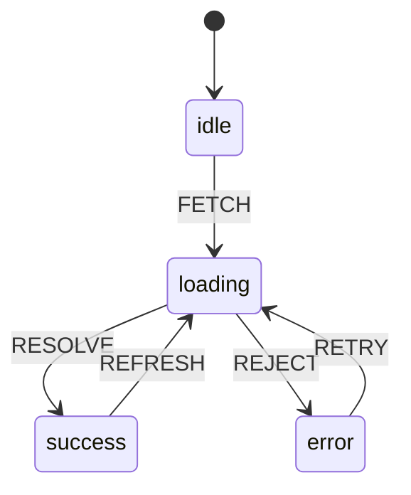

<!-- prettier-ignore-start -->

## 📋 Table of Contents
{: .no_toc }
- TOC
{:toc}

<!-- prettier-ignore-end -->

> _"State is the memory of a machine; in a UI, it is the memory of the user's intent made visible."_

---

## Learning Objectives

By the end of this lesson, you will be able to:

| Objective                                                            | Bloom's Level |
| -------------------------------------------------------------------- | ------------- |
| Define "state" in both theoretical (FSM) and practical (UI) contexts | Understand    |
| Classify different types of state (UI, form, server, URL, shared)    | Analyze       |
| Model a UI flow as a finite state machine                            | Apply         |
| Identify and refactor state antipatterns                             | Evaluate      |
| Choose appropriate state management tools for different scenarios    | Create        |

---

## What Is State? (Two Perspectives)

### The Machine Perspective (Formal Model)

A **finite set of internal conditions** that determine behavior in response to events.

```
┌─────────────────────────────────────────────────────────┐
│              FINITE STATE MACHINE (FSM)                  │
├─────────────────────────────────────────────────────────┤
│  STATES       Discrete conditions (idle, loading, etc.)  │
│  TRANSITIONS  Edges between states                       │
│  EVENTS       Triggers for transitions                   │
│  GUARDS       Conditions that allow/block transitions    │
│  EFFECTS      Side effects on transition (fetch, log)    │
└─────────────────────────────────────────────────────────┘
```

### The UI Perspective (Practical Reality)

The **current snapshot** of data and UI that determines **what is displayed** and **how the interface responds** to user actions.

```javascript
// UI State is multidimensional:
const appState = {
	// 📊 DATA: What we're displaying
	tasks: [{ id: 1, text: 'Learn state', done: false }],
	searchResults: [],

	// 🚦 FLAGS: What's happening right now
	isLoading: false,
	isSubmitting: false,
	hasError: false,

	// 👤 IDENTITY: Who's here
	user: { id: 'abc', role: 'admin' },

	// 📝 META: Information about information
	errors: [],
	validation: { email: 'valid', name: 'too short' },
	pagination: { page: 1, total: 10 },

	// 🌍 ENVIRONMENT: External conditions
	isOnline: true,
	theme: 'dark',
	viewport: 'desktop',
};
```

> 💭 **Didactic Epigraph** > _"State is the memory of interaction: what has already happened + what the user expects to happen."_

---

## The State Taxonomy

Most state bugs come not from "bad state" but from **mixing incompatible state types**. A useful taxonomy:

| Type             | What It Contains         | Where It Lives         | Examples                            |
| ---------------- | ------------------------ | ---------------------- | ----------------------------------- |
| **UI State**     | Local component state    | `useState` / component | Active tab, modal open, focus       |
| **Form State**   | Input values, validation | Form library or local  | Field values, errors, dirty/touched |
| **Server State** | Remote data              | Cache layer            | Lists, entities, permissions        |
| **URL State**    | Navigation + filters     | Browser URL            | Page, search query, filters         |
| **Shared State** | Cross-component data     | Context / Store        | Auth, theme, cart                   |

### 🎯 The Golden Rule

> If a piece of data must **survive page reload** or be **shareable via link**, it probably belongs in **URL state** or **server state**, not in local state.

```javascript
// ❌ Wrong: filter in local state
const [filter, setFilter] = useState('active');

// ✅ Right: filter in URL
const [searchParams, setSearchParams] = useSearchParams();
const filter = searchParams.get('filter') || 'all';
```

---

## State Machines: From Theory to Practice

### Mapping FSM Concepts to UI

| FSM Concept    | UI Equivalent                 | Example                               |
| -------------- | ----------------------------- | ------------------------------------- |
| **State**      | Coherent UI snapshot          | `idle`, `loading`, `success`, `error` |
| **Transition** | User action or async response | click, HTTP response, timer           |
| **Guard**      | Validation before transition  | `if (form.isValid)`                   |
| **Effect**     | Side effect on transition     | fetch, navigate, track analytics      |

### Why State Machines Matter for UI

Modeling a complex flow as an FSM **eliminates impossible states**:

```javascript
// ❌ The Boolean Explosion Problem
const [isLoading, setIsLoading] = useState(false);
const [hasError, setHasError] = useState(false);
const [hasData, setHasData] = useState(false);

// Possible combinations: 2³ = 8 states
// Valid combinations: 4 (idle, loading, success, error)
// Invalid combinations: 4 (e.g., loading + error + data = ???)

// ✅ The FSM Solution
type Status = 'idle' | 'loading' | 'success' | 'error';
const [status, setStatus] = useState < Status > 'idle';

// Possible states: 4
// Invalid states: 0
```

### FSM vs Statecharts

| FSM (Simple)          | Statecharts (Harel)          |
| --------------------- | ---------------------------- |
| 1 active state        | Nested states (hierarchy)    |
| Linear flows          | Parallel states (orthogonal) |
| No memory             | History (return to previous) |
| Good for simple flows | Good for real UI complexity  |

**Why Statecharts for UI?**

Real UIs are **concurrent systems**: "modal open" + "fetch in progress" + "user typing" can all be true simultaneously. With boolean flags, you multiply combinations. With statecharts, you **control the state space**.

---

## Canonical FSM Diagram: `idle → loading → success/error`



> 📐 **Didactic Note**
> This diagram is not decorative. It defines **allowed logic**. Any transition not shown is **forbidden**. The diagram _is_ the specification.

---

## The Evolution of State Management

| Era                               | Approach                 | State Location      | Pros                    | Cons               |
| --------------------------------- | ------------------------ | ------------------- | ----------------------- | ------------------ |
| **1. Server Render**              | Multi-page apps          | Server (session)    | Simple mental model     | Full page reloads  |
| **2. jQuery DOM**                 | Implicit state           | DOM + globals       | Quick prototypes        | "Spaghetti state"  |
| **3. SPA + MVC/MVVM**             | Client-side architecture | Structured models   | Better organization     | Complex patterns   |
| **4. Flux/Redux**                 | Unidirectional flow      | Centralized store   | Predictable, debuggable | Boilerplate        |
| **5. React Hooks**                | Composable primitives    | Component + context | Ergonomic, flexible     | useEffect pitfalls |
| **6. Statecharts (XState)**       | Formal modeling          | Machine definitions | Robust, visualizable    | Learning curve     |
| **7. Server State (React Query)** | Cache + sync             | Dedicated cache     | Solves async complexity | Another layer      |
| **8. Signals**                    | Fine-grained reactivity  | Reactive atoms      | Minimal re-renders      | Paradigm shift     |

### The Arc of History

```
Server owns state → Client owns state → Client + Server share state with sync layer
       ↓                  ↓                              ↓
    Simple              Complex                     Specialized tools
```

---

## Why React Changed Everything

React introduced a **paradigm shift** in how we think about UI:

### The Declarative Model

```
┌─────────────────────────────────────────────────────────┐
│                  THE REACT EQUATION                      │
│                                                          │
│                    UI = f(state)                         │
│                                                          │
│     "The interface is a pure function of the state"     │
└─────────────────────────────────────────────────────────┘
```

### Before React

```javascript
// Imperative: describe HOW to update
button.addEventListener('click', () => {
	const span = document.getElementById('count');
	span.textContent = parseInt(span.textContent) + 1;
});
```

### After React

```javascript
// Declarative: describe WHAT the UI should be
function Counter() {
	const [count, setCount] = useState(0);
	return <button onClick={() => setCount((c) => c + 1)}>Count: {count}</button>;
}
// React figures out the HOW (Virtual DOM, reconciliation)
```

### Key Innovations

| Concept                   | What It Means                         | Why It Matters    |
| ------------------------- | ------------------------------------- | ----------------- |
| **Virtual DOM**           | In-memory diff before real DOM update | Efficient updates |
| **Declarative Rendering** | Describe output, not mutations        | Predictable UI    |
| **Hooks (2019)**          | Composable state logic                | Reusable patterns |
| **Concurrency**           | Prioritized rendering                 | Responsive UX     |

> 🔥 **Guiding Insight** > _"Don't synchronize the DOM; synchronize the state. When state is correct, UI follows naturally."_

---

## Common State Antipatterns

### ❌ Antipattern 1: Derived State Stored as State

Storing a value that can be computed from other state creates **synchronization bugs**.

```javascript
// ❌ Wrong: storing derived value
const [items, setItems] = useState([]);
const [total, setTotal] = useState(0); // Derived!

function addItem(item) {
	setItems([...items, item]);
	setTotal(total + item.price); // Can get out of sync!
}

// ✅ Right: compute on render
const [items, setItems] = useState([]);
const total = items.reduce((sum, item) => sum + item.price, 0);
```

### ❌ Antipattern 2: Boolean Flag Explosion

Multiple boolean flags create impossible states.

```javascript
// ❌ Wrong: flags that can conflict
const [isLoading, setIsLoading] = useState(false);
const [hasError, setHasError] = useState(false);
const [hasData, setHasData] = useState(false);
// What if all three are true? 🤯

// ✅ Right: discriminated union
type State =
	| { status: 'idle' }
	| { status: 'loading' }
	| { status: 'success', data: Data }
	| { status: 'error', error: Error };
```

### ❌ Antipattern 3: Uncontrolled Effects

`fetch` calls scattered everywhere create **race conditions**.

```javascript
// ❌ Wrong: fetch inside component body
useEffect(() => {
	fetchData().then(setData); // What if component unmounts?
}, [query]); // What if query changes before response?

// ✅ Right: controlled with abort/cancellation
useEffect(() => {
	const controller = new AbortController();
	fetchData({ signal: controller.signal }).then(setData);
	return () => controller.abort();
}, [query]);

// ✅ Better: use React Query/SWR
const { data, isLoading, error } = useQuery(['data', query], fetchData);
```

### ❌ Antipattern 4: Stale Closures

Event handlers capturing outdated state.

```javascript
// ❌ Wrong: closure captures stale count
const [count, setCount] = useState(0);
const handleClick = () => {
	setTimeout(() => {
		setCount(count + 1); // 'count' is stale after 1 second
	}, 1000);
};

// ✅ Right: functional update
const handleClick = () => {
	setTimeout(() => {
		setCount((c) => c + 1); // Uses current value
	}, 1000);
};
```

---

## Modern State Concepts

### 1. Immutability + Reducers

**Principle**: Never mutate state directly. Return new state objects.

**Benefits**:

- Predictable updates
- Time-travel debugging
- Safe concurrent rendering

```javascript
// Reducer pattern (FSM-like)
function reducer(state, action) {
	switch (action.type) {
		case 'INCREMENT':
			return { ...state, count: state.count + 1 };
		case 'RESET':
			return { ...state, count: 0 };
		default:
			return state;
	}
}
```

### 2. Unidirectional Data Flow

```
    ┌─────────────────────────────────────────┐
    │                                         │
    │    ┌──────────────────────────────┐    │
    │    │           STATE               │    │
    │    └──────────────┬───────────────┘    │
    │                   │                     │
    │                   ▼                     │
    │    ┌──────────────────────────────┐    │
    │    │            VIEW               │    │
    │    └──────────────┬───────────────┘    │
    │                   │                     │
    │                   ▼                     │
    │    ┌──────────────────────────────┐    │
    │    │          ACTIONS              │    │
    │    └──────────────┬───────────────┘    │
    │                   │                     │
    └───────────────────┘                     │
                                              │
    Data flows in one direction only ─────────┘
```

### 3. Separation of Concerns

| Concern              | Where It Belongs                         |
| -------------------- | ---------------------------------------- |
| **Pure state logic** | Reducers, state machines                 |
| **Side effects**     | useEffect, services, machine invocations |
| **Derived data**     | Selectors, computed values               |
| **UI rendering**     | Components                               |

### 4. Server State as a Distinct Category

React Query / SWR recognize that server data has unique concerns:

```javascript
// Server state concerns
const {
	data, // Cached value
	isLoading, // First fetch
	isFetching, // Any fetch (including refetch)
	isStale, // Needs revalidation?
	error, // What went wrong?
	refetch, // Manual refresh
} = useQuery(['todos'], fetchTodos, {
	staleTime: 5000, // 5s before stale
	cacheTime: 300000, // 5min in cache after unmount
});
```

---

## Practical Examples

### Example 1: Counter in Vanilla JS

```html
<button id="btn">
	Contador:
	<span id="count">0</span>
</button>
<script>
	let count = 0; // State: a variable
	const btn = document.getElementById('btn');
	const span = document.getElementById('count');
	btn.addEventListener('click', () => {
		count++; // Update state
		span.textContent = count; // Manually sync UI
	});
</script>
```

**Key Observation**: State is implicit. Synchronization is manual.

### Example 2: Counter in React (useState)

```jsx
import { useState } from 'react';

export default function Counter() {
	const [count, setCount] = useState(0);

	return <button onClick={() => setCount((c) => c + 1)}>Contador: {count}</button>;
}
```

**Key Observation**: State is explicit. UI automatically reflects state.

### Example 3: Counter with Reducer (FSM-like)

```jsx
import { useReducer } from 'react';

type State = { count: number };
type Action = { type: 'INCREMENT' } | { type: 'RESET' };

function reducer(state: State, action: Action): State {
	switch (action.type) {
		case 'INCREMENT':
			return { count: state.count + 1 };
		case 'RESET':
			return { count: 0 };
		default:
			return state;
	}
}

export default function Counter() {
	const [state, dispatch] = useReducer(reducer, { count: 0 });

	return (
		<div>
			<p>Count: {state.count}</p>
			<button onClick={() => dispatch({ type: 'INCREMENT' })}>+1</button>
			<button onClick={() => dispatch({ type: 'RESET' })}>Reset</button>
		</div>
	);
}
```

**Key Observation**: State transitions are explicit actions. Reducer is pure and testable.

### Example 4: Fetch State as FSM (TypeScript)

```typescript
type Status = 'idle' | 'loading' | 'success' | 'error';

type State<T> =
	| { status: 'idle' }
	| { status: 'loading' }
	| { status: 'success'; data: T }
	| { status: 'error'; error: string };

type Action<T> = { type: 'FETCH' } | { type: 'RESOLVE'; data: T } | { type: 'REJECT'; error: string };

function reducer<T>(state: State<T>, action: Action<T>): State<T> {
	switch (action.type) {
		case 'FETCH':
			return { status: 'loading' };
		case 'RESOLVE':
			return { status: 'success', data: action.data };
		case 'REJECT':
			return { status: 'error', error: action.error };
		default:
			return state;
	}
}
```

**Key Observation**: Status is a discriminated union. No impossible states.

### Example 5: XState (Formal State Machine)

```typescript
import { createMachine } from 'xstate';

export const fetchMachine = createMachine({
	id: 'fetch',
	initial: 'idle',
	states: {
		idle: { on: { FETCH: 'loading' } },
		loading: {
			on: {
				RESOLVE: 'success',
				REJECT: 'error',
			},
		},
		success: { on: { FETCH: 'loading' } },
		error: { on: { RETRY: 'loading' } },
	},
});
```

**Key Observation**: The state machine is the source of truth. It can be visualized and tested.

---

## Didactic Sequence

A recommended learning progression:

```
┌─────────────────────────────────────────────────────────┐
│               LEARNING PROGRESSION                       │
├─────────────────────────────────────────────────────────┤
│ 1. COUNTER (useState)                                    │
│    → Understand local state, updates, and re-renders     │
│                                                          │
│ 2. FORM (validation as guards)                           │
│    → Understand derived state, errors as meta-state      │
│                                                          │
│ 3. ASYNC FETCH (idle/loading/success/error)              │
│    → Model as FSM, understand discriminated unions       │
│                                                          │
│ 4. REDUCER PATTERN (useReducer)                          │
│    → Pure state transitions, actions, testability        │
│                                                          │
│ 5. FORMAL STATE MACHINES (XState)                        │
│    → Parallel states, hierarchy, visualization           │
│                                                          │
│ 6. SERVER STATE (React Query / SWR)                      │
│    → Cache, revalidation, stale-while-revalidate         │
└─────────────────────────────────────────────────────────┘
```

---

## Hands-On Activities

### 🔬 Activity 1: Boolean Flags vs FSM

**Task**: Create a fetch component with boolean flags, then break it.

1. Implement `isLoading`, `hasError`, `hasData` as separate booleans
2. Create a scenario where all three are `true` simultaneously
3. Refactor to use a single `status` field with FSM pattern

**Reflection**: What changed? Which is easier to reason about?

---

### 🔬 Activity 2: Testable Reducer

**Task**: Write pure reducer tests.

```typescript
describe('counterReducer', () => {
	it('increments correctly', () => {
		const state = { count: 0 };
		const action = { type: 'INCREMENT' };
		const next = reducer(state, action);
		expect(next.count).toBe(1);
	});

	it('ignores invalid actions', () => {
		const state = { count: 5 };
		const action = { type: 'UNKNOWN' };
		const next = reducer(state, action);
		expect(next).toBe(state); // Same reference = no change
	});
});
```

---

### 🔬 Activity 3: Diagram First, Code Second

**Task**: Design a login flow.

1. Draw the statechart: `loggedOut → loggingIn → loggedIn` (with errors, retry)
2. Define all transitions: what event triggers each?
3. Define guards: what conditions must be true?
4. Only then: implement in code

**Deliverable**: Mermaid diagram + XState or reducer implementation.

---

### 🔬 Activity 4: Server State Analysis

**Task**: Build a paginated list.

Questions to answer:

- What state lives in the URL?
- What lives in cache?
- What is local UI state?

Draw boundaries clearly before coding.

---

## Koans and Haikus

### 🧘 Koan 1

> _"Write code for humans first, computers second; the Tao lies in balancing both."_

### 📜 Haiku 1: The Flow of State

> Estado fluye ya
> memoria de intención
> la UI respira

_Translation: State already flows / memory of intention / the UI breathes_

---

### 🧘 Koan 2

> _"Experience is simply the name we give to our bugs after we fix them."_

### 📜 Haiku 2: The Diagram

> Diagrama en mano
> la máquina canta su ruta
> bugs en silencio

_Translation: Diagram in hand / the machine sings its route / bugs in silence_

---

### 🧘 Koan 3

> _"Quien guarda diez banderas para un solo flujo,
> termina programando la excepción como producto."_

_Translation: "Who stores ten flags for a single flow, ends up programming exceptions as the product."_

### 📜 Haiku 3: The One State

> Un solo estado
> evita mil conjeturas
> paz en el render

_Translation: A single state / avoids a thousand guesses / peace in the render_

---

## References

### Essential Documentation

- [React Hooks Reference](https://react.dev/reference/react)
- [XState Documentation](https://stately.ai/docs/xstate)
- [TanStack Query (React Query)](https://tanstack.com/query/latest)
- [Redux Toolkit](https://redux.js.org/)

### Conceptual Reading

- [Elm Architecture Guide](https://guide.elm-lang.org/) — The origin of unidirectional data flow
- [XState Visualizer](https://stately.ai/viz) — See your state machines
- [MDN JavaScript Guide](https://developer.mozilla.org/en-US/docs/Web/JavaScript)

### Further Exploration

- **Signals**: [Solid.js](https://www.solidjs.com/), [Preact Signals](https://preactjs.com/guide/v10/signals/)
- **Statecharts Theory**: David Harel's original paper

---

## 🔗 Lesson Navigation

| Previous                                                                                    | Current        | Next                                                     |
| ------------------------------------------------------------------------------------------- | -------------- | -------------------------------------------------------- |
| [AI-Assisted Development Foundations](../ai-assisted-development-foundations/) | **State & UI** | [React Programming Fundamentals](../react-fundamentals/) |

---

> _"Un solo estado evita mil conjeturas — paz en el render."_
