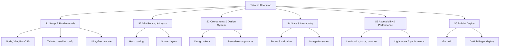

<!-- prettier-ignore-start -->

## 📋 Table of Contents
{: .no_toc }
- TOC
{:toc}

<!-- prettier-ignore-end -->

# Tailwind CSS Teaching Roadmap

## Concept Map

> “To design is to think critically through making — each line of code is both form and reflection.”

- **S1 — Setup & Fundamentals:**

  - Install and configure Node and Vite. Explain **npm** (Node’s package manager) and **npx** (package runner bundled with npm v5.2+)[freecodecamp.org](https://www.freecodecamp.org/news/npm-vs-npx-whats-the-difference/#:~:text=npm%20,packages%20both%20globally%20and%20locally)[freecodecamp.org](https://www.freecodecamp.org/news/npm-vs-npx-whats-the-difference/#:~:text=npx%20the%20package%20runner). Use `npm create vite@latest` to scaffold a new project, and run `npx vite` to start the dev server[developer.mozilla.org](https://developer.mozilla.org/en-US/docs/Learn_web_development/Extensions/Client-side_tools/Package_management#:~:text=bash).

  - Discuss build tools vs. static files: Vite’s `build` command bundles assets into a `dist/` folder[vite.dev](https://vite.dev/guide/static-deploy#:~:text=By%20default%2C%20the%20build%20output,any%20of%20your%20preferred%20platforms), stripping out dev-only features (like HMR) for production[developer.mozilla.org](https://developer.mozilla.org/en-US/docs/Learn_web_development/Extensions/Client-side_tools/Package_management#:~:text=However%2C%20this%20code%20is%20not,will%20just%20bloat%20your%20site). Explain that this `dist/` (or configured outDir) is what gets deployed to static hosts (e.g. GitHub Pages).

  - Add Tailwind CSS: run `npm install -D tailwindcss postcss autoprefixer`, create `tailwind.config.js` and `postcss.config.js`, and include `@tailwind base; @tailwind components; @tailwind utilities;` in your main CSS[blog.logrocket.com](https://blog.logrocket.com/top-utility-first-css-frameworks/#:~:text=Tailwind%20CSS)[freecodecamp.org](https://www.freecodecamp.org/news/what-is-postcss/#:~:text=PostCSS%20is%20also%20used%20by,which%20is%20a%20PostCSS%20plugin). Explain that Tailwind is a PostCSS plugin, and PostCSS is a Node tool that transforms CSS via plugins[freecodecamp.org](https://www.freecodecamp.org/news/what-is-postcss/#:~:text=PostCSS%20is%20a%20Node,your%20styles%20using%20JavaScript%20plugins)[freecodecamp.org](https://www.freecodecamp.org/news/what-is-postcss/#:~:text=PostCSS%20is%20also%20used%20by,which%20is%20a%20PostCSS%20plugin).

  - Introduce **utility-first CSS**: classes like `.bg-blue` apply a single style (e.g. `background-color: blue`)[css-irl.info](https://css-irl.info/a-year-of-utility-classes/#:~:text=Utility%20classes%20are%20CSS%20class,established). Briefly survey atomic CSS history: e.g. BASSCSS (2013) and Tachyons (2014) provided sets of utility classes[andreipfeiffer.dev](https://andreipfeiffer.dev/blog/2022/scalable-css-evolution/part6-atomic-css#:~:text=BASSCSS), and Tailwind (2017) popularized the approach with easy names and many responsive variants[andreipfeiffer.dev](https://andreipfeiffer.dev/blog/2022/scalable-css-evolution/part6-atomic-css#:~:text=Tailwind)[en.wikipedia.org](https://en.wikipedia.org/wiki/Tailwind_CSS#:~:text=Tailwind%20CSS%20is%20an%20open,6). Mention that Tailwind’s PostCSS processing removes unused classes in production to keep builds small[vite.dev](https://vite.dev/guide/assets#:~:text=imgUrl).

  - **Practice with Tailwind utilities:** experiment with spacing (`p-4`, `m-2`), typography (`text-lg`), layout (`flex`, `grid`), colors (`text-white`, `bg-red-500`), and responsive prefixes (e.g. `md:`) in a simple hero/CTA page. This hands-on work reinforces the theory of utility classes.

  - **Static assets:** demonstrate importing images or other files. For example, `import logoUrl from './logo.svg'` returns a URL string to use in ``[vite.dev](https://vite.dev/guide/assets#:~:text=imgUrl). Explain that Vite will hash and optimize assets in the `dist/` build.

  - **Extras (optional):** Mention how to add TypeScript (`npm i -D typescript` + `tsconfig.json` then rename `.js`→`.ts`)[typescriptlang.org](https://www.typescriptlang.org/docs/handbook/migrating-from-javascript.html#:~:text=TypeScript%20doesn%E2%80%99t%20exist%20in%20a,We%20assume%20you%E2%80%99ve%20read)[kvz.io](https://kvz.io/blog/js-to-ts.html#:~:text=Folks%20on%20the%20internet%20say%3A,then%20turn%20them%20into%20errors). Note that linters/formatters like **ESLint** and **Prettier** enforce code quality; e.g. Prettier handles formatting while ESLint catches errors[prettier.io](https://prettier.io/docs/integrating-with-linters#:~:text=Linters%20usually%20contain%20not%20only,Linters). Introduce **Vitest** (a Vite-powered test runner similar to Jest) for writing unit tests, e.g. `sum.test.js` with `vitest`[vitest.dev](https://vitest.dev/guide/#:~:text=Vitest%20%28pronounced%20as%20,testing%20framework%20powered%20by%20Vite).

  - **Deliverable:** A responsive landing page (hero section + CTA) styled with Tailwind utilities.

  - **Estimated Effort:** ~3–4 hours.

### S1 — Step-by-step (Mobile-First, Utility-First)

1. Install Node LTS (20+). Create project: `npm create vite@latest` → vanilla template → `npm i` → `npm run dev`.
2. Install Tailwind and tooling: `npm i -D tailwindcss postcss autoprefixer` → `npx tailwindcss init -p`.
3. Configure `tailwind.config.js` `content` to include your HTML/JS paths.
4. In `main.css` add: `@tailwind base; @tailwind components; @tailwind utilities;`.
5. Build a hero + CTA using utilities for spacing, typography, layout. Keep base styles mobile; use responsive prefixes (`sm: md: lg:`) for enhancement.
6. Commit: "S1: Vite + Tailwind setup; hero/CTA mobile-first".

Atelier critical questions (S1):

- Exploration: What did you learn by composing with utilities vs writing custom CSS?
- Reflection: Which choices improved readability or hindered it?
- Conceptualization: How does utility-first relate to design systems and tokens?
- Production: What does your commit message communicate clearly?
- Exhibition: How will you demo mobile-first behavior live?

## S2 — SPA Routing & Layout

- **SPA vs MPA:** Explain that a **Single-Page Application (SPA)** loads one HTML page and uses JavaScript to update content and routes on the client[cleancommit.io](https://cleancommit.io/blog/spa-vs-mpa-which-is-the-king/#:~:text=There%20are%20two%20main%20architecture,as%20blogs%20or%20news%20websites)[developer.mozilla.org](https://developer.mozilla.org/en-US/docs/Glossary/CSR#:~:text=Client,together%20in%20the%20same%20application). This avoids full-page reloads and gives a smoother UX, at the cost of initial load time and SEO considerations. By contrast, a Multi-Page App (MPA) fetches a new HTML document from the server on each navigation[cleancommit.io](https://cleancommit.io/blog/spa-vs-mpa-which-is-the-king/#:~:text=There%20are%20two%20main%20architecture,as%20blogs%20or%20news%20websites). Note that SPAs typically use client-side rendering (CSR): the browser runs JS to generate the page content dynamically[developer.mozilla.org](https://developer.mozilla.org/en-US/docs/Glossary/CSR#:~:text=Client,together%20in%20the%20same%20application)[developer.mozilla.org](https://developer.mozilla.org/en-US/docs/Glossary/CSR#:~:text=Benefits%20of%20CSR%20include%3A). CSR enables fast, app-like interactions (clicking links or buttons only updates parts of the page) but requires that the browser has JavaScript enabled[developer.mozilla.org](https://developer.mozilla.org/en-US/docs/Glossary/CSR#:~:text=Benefits%20of%20CSR%20include%3A).

- **Routing:** Implement a simple **hash-based router** for our SPA. Use `window.onhashchange` (or listen to the `hashchange` event) to detect when `window.location.hash` changes[stackoverflow.com](https://stackoverflow.com/questions/54231533/how-to-create-a-vanilla-js-routing-for-spa#:~:text=The%20strategy%20is%20to%20add,and%20inject%20the%20relevant%20content). For example, links like `<a href="/#/about">About</a>` won’t reload the page; instead, `window.onhashchange` fires and we parse `location.hash` (e.g. `#/about`) to decide what content to render. Show a basic JS snippet that swaps `innerHTML` of a main container based on the current hash[stackoverflow.com](https://stackoverflow.com/questions/54231533/how-to-create-a-vanilla-js-routing-for-spa#:~:text=The%20strategy%20is%20to%20add,and%20inject%20the%20relevant%20content). (Hash routing is easy to set up and avoids server config, though we could note that the modern History API is an alternative.)

- **Layout & Components:** Create a **Navbar** and **Footer** as shared components (e.g. common HTML or JS-rendered templates). The Navbar has links that set different hashes (`#/, #/projects`, etc.). Build a main view container (`<main>` or `
`) where content is injected. Demonstrate how clicking a nav link changes the hash and triggers the onhashchange handler to swap views. Emphasize **accessibility**: use semantic elements (`<nav>`, `<footer>`, `<main>`), proper link text, and focus states (e.g. `focus-visible` classes in Tailwind).

- **Deliverable:** A basic two-page SPA (e.g. “Home” and “About” views) styled with Tailwind. The user can click between pages without full reload, and the URL hash updates accordingly. Ensure the layout (nav and footer) is responsive.

- **Estimated Effort:** ~2–3 hours.

### S2 — Step-by-step (Routing, Shared Layout)

1. Create `index.html` with `<nav>`, `<main id="app">`, `<footer>`; style with utilities.
2. Add `router.js`: on `hashchange` render views into `#app` based on `location.hash`.
3. Implement two views: Home and About. Ensure focus states are visible (`focus-visible`).
4. Add skip-link and landmarks for accessibility.
5. Commit: "S2: Hash router + shared layout, accessible nav".

Atelier critical questions (S2):

- Exploration: What UX improves when avoiding full page reloads?
- Reflection: Which accessibility trade-offs did CSR introduce?
- Conceptualization: How do routes shape narrative and information architecture?
- Production: Is your router code small, clear, and documented?
- Exhibition: How will you demo route changes and focus handling?

## S3 — Components & Design System

- Design tokens: extend Tailwind theme (or use CSS variables) for colors, spacing, radii.
- Reusable components: Button, Card, Section using utility composition (and optional `@apply`).
- Projects grid: consistent spacing, headings, and responsive behavior.

### S3 — Step-by-step

1. Define a minimal token set in `tailwind.config.js` (`theme.extend.colors`, spacing, borderRadius).
2. Build `btn` and `card` patterns with utilities; cover hover/focus/disabled states.
3. Compose a responsive grid of cards (`grid grid-cols-1 sm:grid-cols-2 lg:grid-cols-3 gap-6`).
4. Commit: "S3: Tokens + reusable components (buttons, cards)".

Atelier critical questions (S3):

- Exploration: Which utilities best express your design tokens?
- Reflection: Where did reuse reduce complexity? Where did it obscure intent?
- Conceptualization: How do tokens relate to brand and accessibility?
- Production: Are components documented (props/variants) in README?
- Exhibition: Can you demo component variants quickly?

## S4 — State & Interactivity

- Add a contact form with client-side validation; expose errors accessibly.
- Enhance navigation: active states, `aria-current`, reduced motion.
- Light JS state for tabs or a collapsible menu.

### S4 — Step-by-step

1. Mark up the form with labels, descriptions, and error containers.
2. Implement validation; announce errors via `aria-live` and associate with inputs.
3. Apply active nav styles and keyboard support; respect `prefers-reduced-motion`.
4. Commit: "S4: Form validation + interactive nav (accessible)".

Atelier critical questions (S4):

- Exploration: What interaction improved task completion?
- Reflection: Did any animation hinder users with motion sensitivity?
- Conceptualization: How do state, feedback, and affordances shape UX?
- Production: Is interactivity testable and progressively enhanced?
- Exhibition: What scenario will you demo to evidence usability?

## S5 — Accessibility & Performance

- Audit landmarks, headings, color contrast, focus order.
- Optimize images and fonts; prefer system fonts where possible.
- Run Lighthouse; address high-impact issues.

### S5 — Step-by-step

1. Add skip link; verify `<main>`, `<nav>`, and headings hierarchy.
2. Check contrast; adjust tokens to meet WCAG AA.
3. Optimize images (sizes/formats); run Lighthouse and record improvements.
4. Commit: "S5: A11y + performance pass; tokens adjusted".

Atelier critical questions (S5):

- Exploration: Which audit finding surprised you?
- Reflection: Who is excluded by current choices and how did you respond?
- Conceptualization: What is “enough” performance for your audience/context?
- Production: Are changes minimal yet impactful?
- Exhibition: Show before/after audit metrics.

## S6 — Build & Deploy

- Production build with Vite; verify the `dist/` output.
- Deploy to GitHub Pages; set `base` if needed for repo subpath.
- Document deployment in README.

### S6 — Step-by-step

1. Configure `vite.config` `base: '/repo-name/'` if deploying under a subpath.
2. `npm run build` and test `dist/` locally or with a static server.
3. Publish to GitHub Pages; verify routes and asset paths.
4. Commit: "S6: Production build + deployment notes".

Atelier critical questions (S6):

- Exploration: What changed between dev and prod builds?
- Reflection: How does the deployment story affect students/users?
- Conceptualization: What makes a project “ready” to show?
- Production: Is the README clear for future contributors?
- Exhibition: What narrative will you present with the live site?

## References

- MDN — Package management basics: https://developer.mozilla.org/en-US/docs/Learn_web_development/Extensions/Client-side_tools/Package_management
- Vite — Deploying a static site: https://vite.dev/guide/static-deploy
- Vite — Assets handling: https://vite.dev/guide/assets
- Tailwind CSS — Docs (install, config, content): https://tailwindcss.com/docs/installation
- LogRocket — Utility-first CSS overview: https://blog.logrocket.com/top-utility-first-css-frameworks/
- CSS-IRL — A year of utility classes: https://css-irl.info/a-year-of-utility-classes/
- PostCSS — What is PostCSS (FreeCodeCamp): https://www.freecodecamp.org/news/what-is-postcss/
- TypeScript — Migrating from JavaScript: https://www.typescriptlang.org/docs/handbook/migrating-from-javascript.html
- Vitest — Getting started: https://vitest.dev/guide/
- MDN — CSR (Client-side rendering): https://developer.mozilla.org/en-US/docs/Glossary/CSR
- CleanCommit — SPA vs MPA primer: https://cleancommit.io/blog/spa-vs-mpa-which-is-the-king/
- StackOverflow — Vanilla JS hash routing: https://stackoverflow.com/questions/54231533/how-to-create-a-vanilla-js-routing-for-spa