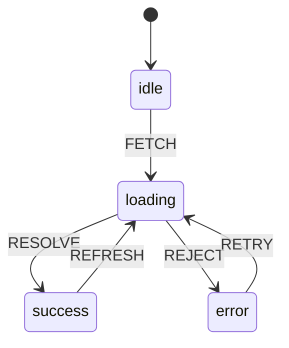

<!-- prettier-ignore-start -->

## 📋 Tabla de contenidos
{: .no_toc }
- TOC
{:toc}

<!-- prettier-ignore-end -->

> _"El estado es la memoria de una máquina; en una interfaz, es la memoria de la intención del usuario hecha visible."_

---

## Objetivos de aprendizaje

Al final de esta lección, serás capaz de:

| Objetivo | Nivel de Bloom |
| --- | --- |
| Definir "estado" tanto en contexto teórico (FSM) como práctico (UI) | Comprender |
| Clasificar diferentes tipos de estado (UI, formularios, servidor, URL, compartido) | Analizar |
| Modelar un flujo de UI como una máquina de estados finita | Aplicar |
| Identificar y refactorizar antipatrones de estado | Evaluar |
| Elegir herramientas de gestión de estado según el escenario | Crear |

---

## ¿Qué es el estado? (dos perspectivas)

### Perspectiva de máquina (modelo formal)

Un **conjunto finito de condiciones internas** que determinan el comportamiento en respuesta a eventos.

```
┌─────────────────────────────────────────────────────────┐
│            MÁQUINA DE ESTADOS FINITA (FSM)               │
├─────────────────────────────────────────────────────────┤
│  ESTADOS      Condiciones discretas (idle, loading, etc.)│
│  TRANSICIONES Aristas entre estados                      │
│  EVENTOS      Disparadores de transiciones               │
│  GUARDAS      Condiciones que permiten/bloquean          │
│  EFECTOS      Side effects al transicionar (fetch, log)  │
└─────────────────────────────────────────────────────────┘
```

### Perspectiva de UI (realidad práctica)

El **snapshot actual** de datos y UI que determina **qué se muestra** y **cómo responde la interfaz** a las acciones del usuario.

```javascript
// El estado de UI es multidimensional:
const appState = {
	// 📊 DATOS: lo que mostramos
	tasks: [{ id: 1, text: 'Aprender estado', done: false }],
	searchResults: [],

	// 🚦 FLAGS: qué está pasando ahora
	isLoading: false,
	isSubmitting: false,
	hasError: false,

	// 👤 IDENTIDAD: quién está aquí
	user: { id: 'abc', role: 'admin' },

	// 📝 META: información sobre la información
	errors: [],
	validation: { email: 'valid', name: 'too short' },
	pagination: { page: 1, total: 10 },

	// 🌍 ENTORNO: condiciones externas
	isOnline: true,
	theme: 'dark',
	viewport: 'desktop',
};
```

> 💭 **Epígrafe didáctico**
> _"El estado es la memoria de la interacción: lo que ya ocurrió + lo que el usuario espera que ocurra."_

---

## Taxonomía del estado

La mayoría de bugs de estado no vienen de “mal estado” sino de **mezclar tipos incompatibles**. Una taxonomía útil:

| Tipo | Qué contiene | Dónde vive | Ejemplos |
| --- | --- | --- | --- |
| **Estado de UI** | Estado local de componente | `useState` / componente | Tab activo, modal abierto, foco |
| **Estado de formulario** | Valores + validación | Librería de forms o local | Valores, errores, dirty/touched |
| **Estado de servidor** | Datos remotos | Capa de caché | Listas, entidades, permisos |
| **Estado de URL** | Navegación + filtros | URL del navegador | Página, query, filtros |
| **Estado compartido** | Datos cross‑component | Context / Store | Auth, theme, carrito |

### 🎯 Regla de oro

> Si un dato debe **sobrevivir a un reload** o ser **compartible por enlace**, probablemente pertenece a **estado de URL** o **estado de servidor**, no a estado local.

```javascript
// ❌ Mal: filtro en estado local
const [filter, setFilter] = useState('active');

// ✅ Bien: filtro en la URL
const [searchParams, setSearchParams] = useSearchParams();
const filter = searchParams.get('filter') || 'all';
```

---

## Máquinas de estado: de la teoría a la práctica

### Mapear conceptos FSM a UI

| Concepto FSM | Equivalente UI | Ejemplo |
| --- | --- | --- |
| **Estado** | Snapshot coherente de UI | `idle`, `loading`, `success`, `error` |
| **Transición** | Acción de usuario o respuesta async | click, HTTP response, timer |
| **Guarda** | Validación antes de transicionar | `if (form.isValid)` |
| **Efecto** | Side effect al transicionar | fetch, navigate, analytics |

### Por qué importan las máquinas de estado para UI

Modelar un flujo complejo como FSM **elimina estados imposibles**:

```javascript
// ❌ Problema: explosión de booleanos
const [isLoading, setIsLoading] = useState(false);
const [hasError, setHasError] = useState(false);
const [hasData, setHasData] = useState(false);

// Combinaciones posibles: 2³ = 8
// Combinaciones válidas: 4 (idle, loading, success, error)
// Combinaciones inválidas: 4 (p.ej. loading + error + data = ???)

// ✅ Solución FSM
type Status = 'idle' | 'loading' | 'success' | 'error';
const [status, setStatus] = useState<Status>('idle');

// Estados posibles: 4
// Estados inválidos: 0
```

### FSM vs Statecharts

| FSM (simple) | Statecharts (Harel) |
| --- | --- |
| 1 estado activo | Estados anidados (jerarquía) |
| Flujos lineales | Estados paralelos |
| Sin memoria | History (volver al anterior) |
| Bien para flujos simples | Bien para UI compleja |

**¿Por qué statecharts para UI?**

Las UIs reales son **sistemas concurrentes**: “modal abierto” + “fetch en progreso” + “usuario escribiendo” pueden ser verdaderos a la vez. Con flags booleanos multiplicas combinaciones; con statecharts **controlas el espacio de estados**.

---

## Diagrama FSM canónico: `idle → loading → success/error`



> 📐 **Nota didáctica**
> Este diagrama no es decorativo. Define la **lógica permitida**. Cualquier transición no mostrada está **prohibida**. El diagrama _es_ la especificación.

---

## Evolución de la gestión de estado

| Era | Enfoque | Ubicación del estado | Pros | Contras |
| --- | --- | --- | --- | --- |
| **1. Server render** | Apps multipágina | Servidor (sesión) | Modelo mental simple | Reloads |
| **2. jQuery DOM** | Estado implícito | DOM + globals | Prototipos rápidos | “Spaghetti state” |
| **3. SPA + MVC/MVVM** | Arquitectura cliente | Modelos estructurados | Mejor organización | Patrones complejos |
| **4. Flux/Redux** | Flujo unidireccional | Store centralizado | Predecible, depurable | Boilerplate |
| **5. React Hooks** | Primitivas composables | Componente + context | Ergonómico, flexible | Pitfalls de useEffect |
| **6. Statecharts (XState)** | Modelado formal | Definiciones | Robusto, visualizable | Curva de aprendizaje |
| **7. Server state (React Query)** | Caché + sync | Caché dedicada | Resuelve async | Otra capa |
| **8. Signals** | Reactividad fina | Átomos reactivos | Menos re-renders | Cambio de paradigma |

### Arco histórico

```
Servidor posee estado → Cliente posee estado → Cliente + servidor comparten estado con capa de sincronización
       ↓                  ↓                                   ↓
    Simple              Complejo                      Herramientas especializadas
```

---

## Por qué React lo cambió todo

React introdujo un **cambio de paradigma** en cómo pensamos la UI:

### Modelo declarativo

```
┌─────────────────────────────────────────────────────────┐
│                  ECUACIÓN DE REACT                       │
│                                                          │
│                    UI = f(state)                         │
│                                                          │
│      "La interfaz es una función pura del estado"        │
└─────────────────────────────────────────────────────────┘
```

### Antes de React

```javascript
// Imperativo: describe CÓMO actualizar
button.addEventListener('click', () => {
	const span = document.getElementById('count');
	span.textContent = parseInt(span.textContent) + 1;
});
```

### Después de React

```javascript
// Declarativo: describe QUÉ debería ser la UI
function Counter() {
	const [count, setCount] = useState(0);
	return <button onClick={() => setCount((c) => c + 1)}>Count: {count}</button>;
}
// React resuelve el CÓMO (Virtual DOM, reconciliation)
```

### Innovaciones clave

| Concepto | Qué significa | Por qué importa |
| --- | --- | --- |
| **Virtual DOM** | Diff en memoria antes de tocar el DOM real | Updates eficientes |
| **Render declarativo** | Describes salida, no mutaciones | UI predecible |
| **Hooks (2019)** | Lógica composable de estado | Patrones reutilizables |
| **Concurrencia** | Render priorizado | UX responsiva |

> 🔥 **Idea guía**
> _"No sincronices el DOM; sincroniza el estado. Si el estado es correcto, la UI le sigue."_

---

## Antipatrones comunes de estado

### ❌ Antipatrón 1: guardar estado derivado como estado

Guardar un valor que se puede calcular a partir de otro estado crea **bugs de sincronización**.

```javascript
// ❌ Mal: guardar valor derivado
const [items, setItems] = useState([]);
const [total, setTotal] = useState(0); // ¡Derivado!

function addItem(item) {
	setItems([...items, item]);
	setTotal(total + item.price); // Puede desincronizarse
}

// ✅ Bien: calcular en render
const [items, setItems] = useState([]);
const total = items.reduce((sum, item) => sum + item.price, 0);
```

### ❌ Antipatrón 2: explosión de flags booleanos

Muchos booleanos crean estados imposibles.

```javascript
// ❌ Mal: flags que pueden entrar en conflicto
const [isLoading, setIsLoading] = useState(false);
const [hasError, setHasError] = useState(false);
const [hasData, setHasData] = useState(false);
// ¿Y si los tres son true? 🤯

// ✅ Bien: unión discriminada
type State =
	| { status: 'idle' }
	| { status: 'loading' }
	| { status: 'success', data: Data }
	| { status: 'error', error: Error };
```

### ❌ Antipatrón 3: efectos sin control

Llamadas `fetch` repartidas sin disciplina crean **race conditions**.

```javascript
// ❌ Mal: fetch sin control de cancelación
useEffect(() => {
	fetchData().then(setData); // ¿y si el componente desmonta?
}, [query]); // ¿y si query cambia antes de responder?

// ✅ Bien: abort/cancelación
useEffect(() => {
	const controller = new AbortController();
	fetchData({ signal: controller.signal }).then(setData);
	return () => controller.abort();
}, [query]);

// ✅ Mejor: usar React Query/SWR
const { data, isLoading, error } = useQuery(['data', query], fetchData);
```

### ❌ Antipatrón 4: closures obsoletos

Handlers que capturan estado desactualizado.

```javascript
// ❌ Mal: la closure captura count viejo
const [count, setCount] = useState(0);
const handleClick = () => {
	setTimeout(() => {
		setCount(count + 1); // count está obsoleto tras 1s
	}, 1000);
};

// ✅ Bien: update funcional
const handleClick = () => {
	setTimeout(() => {
		setCount((c) => c + 1);
	}, 1000);
};
```

---

## Conceptos modernos de estado

### 1. Inmutabilidad + reducers

**Principio**: no mutes estado directamente. Devuelve nuevos objetos.

**Beneficios**:

- Updates predecibles
- Debugging tipo time-travel
- Render concurrente seguro

```javascript
// Patrón reducer (parecido a FSM)
function reducer(state, action) {
	switch (action.type) {
		case 'INCREMENT':
			return { ...state, count: state.count + 1 };
		case 'RESET':
			return { ...state, count: 0 };
		default:
			return state;
	}
}
```

### 2. Flujo unidireccional de datos

```
    ┌─────────────────────────────────────────┐
    │                                         │
    │    ┌──────────────────────────────┐    │
    │    │           ESTADO              │    │
    │    └──────────────┬───────────────┘    │
    │                   │                     │
    │                   ▼                     │
    │    ┌──────────────────────────────┐    │
    │    │            VISTA              │    │
    │    └──────────────┬───────────────┘    │
    │                   │                     │
    │                   ▼                     │
    │    ┌──────────────────────────────┐    │
    │    │          ACCIONES             │    │
    │    └──────────────┬───────────────┘    │
    │                   │                     │
    └───────────────────┘                     │
                                              │
    Los datos fluyen en una sola dirección ────┘
```

### 3. Separación de responsabilidades

| Responsabilidad | Dónde pertenece |
| --- | --- |
| **Lógica pura** | Reducers, state machines |
| **Side effects** | useEffect, servicios, invocaciones |
| **Datos derivados** | Selectors, computed values |
| **Render UI** | Componentes |

### 4. Server state como categoría distinta

React Query / SWR reconocen que los datos de servidor tienen preocupaciones únicas:

```javascript
const {
	data, // Valor en caché
	isLoading, // Primera carga
	isFetching, // Cualquier fetch (incluye refetch)
	isStale, // ¿Necesita revalidación?
	error, // ¿Qué falló?
	refetch, // Refresh manual
} = useQuery(['todos'], fetchTodos, {
	staleTime: 5000,
	cacheTime: 300000,
});
```

---

## Ejemplos prácticos

### Ejemplo 1: contador en Vanilla JS

```html
<button id="btn">
	Contador:
	<span id="count">0</span>
</button>
<script>
	let count = 0; // Estado: una variable
	const btn = document.getElementById('btn');
	const span = document.getElementById('count');
	btn.addEventListener('click', () => {
		count++; // Actualiza estado
		span.textContent = count; // Sincroniza UI manualmente
	});
</script>
```

**Observación clave**: estado implícito. Sincronización manual.

### Ejemplo 2: contador en React (useState)

```jsx
import { useState } from 'react';

export default function Counter() {
	const [count, setCount] = useState(0);

	return <button onClick={() => setCount((c) => c + 1)}>Contador: {count}</button>;
}
```

**Observación clave**: estado explícito. La UI refleja el estado automáticamente.

### Ejemplo 3: contador con reducer (estilo FSM)

```jsx
import { useReducer } from 'react';

type State = { count: number };

type Action = { type: 'INCREMENT' } | { type: 'RESET' };

function reducer(state: State, action: Action): State {
	switch (action.type) {
		case 'INCREMENT':
			return { count: state.count + 1 };
		case 'RESET':
			return { count: 0 };
		default:
			return state;
	}
}

export default function Counter() {
	const [state, dispatch] = useReducer(reducer, { count: 0 });

	return (
		<div>
			<p>Count: {state.count}</p>
			<button onClick={() => dispatch({ type: 'INCREMENT' })}>+1</button>
			<button onClick={() => dispatch({ type: 'RESET' })}>Reset</button>
		</div>
	);
}
```

**Observación clave**: transiciones explícitas. Reducer puro y testeable.

### Ejemplo 4: estado de fetch como FSM (TypeScript)

```typescript
type Status = 'idle' | 'loading' | 'success' | 'error';

type State<T> =
	| { status: 'idle' }
	| { status: 'loading' }
	| { status: 'success'; data: T }
	| { status: 'error'; error: string };

type Action<T> =
	| { type: 'FETCH' }
	| { type: 'RESOLVE'; data: T }
	| { type: 'REJECT'; error: string };

function reducer<T>(state: State<T>, action: Action<T>): State<T> {
	switch (action.type) {
		case 'FETCH':
			return { status: 'loading' };
		case 'RESOLVE':
			return { status: 'success', data: action.data };
		case 'REJECT':
			return { status: 'error', error: action.error };
		default:
			return state;
	}
}
```

**Observación clave**: unión discriminada sin estados imposibles.

### Ejemplo 5: XState (máquina formal)

```typescript
import { createMachine } from 'xstate';

export const fetchMachine = createMachine({
	id: 'fetch',
	initial: 'idle',
	states: {
		idle: { on: { FETCH: 'loading' } },
		loading: {
			on: {
				RESOLVE: 'success',
				REJECT: 'error',
			},
		},
		success: { on: { FETCH: 'loading' } },
		error: { on: { RETRY: 'loading' } },
	},
});
```

**Observación clave**: la máquina es la fuente de verdad. Se puede visualizar y testear.

---

## Secuencia didáctica

Progresión recomendada:

```
┌─────────────────────────────────────────────────────────┐
│               PROGRESIÓN DE APRENDIZAJE                  │
├─────────────────────────────────────────────────────────┤
│ 1. CONTADOR (useState)                                   │
│    → Estado local, updates, re-renders                    │
│                                                          │
│ 2. FORMULARIO (validación como guardas)                  │
│    → Estado derivado, errores como meta-estado            │
│                                                          │
│ 3. FETCH ASYNC (idle/loading/success/error)              │
│    → Modelar FSM, uniones discriminadas                   │
│                                                          │
│ 4. PATRÓN REDUCER (useReducer)                           │
│    → Transiciones puras, acciones, testabilidad           │
│                                                          │
│ 5. MÁQUINAS FORMALES (XState)                             │
│    → Paralelo, jerarquía, visualización                   │
│                                                          │
│ 6. SERVER STATE (React Query / SWR)                      │
│    → Caché, revalidación, stale-while-revalidate          │
└─────────────────────────────────────────────────────────┘
```

---

## Actividades prácticas

### 🔬 Actividad 1: flags booleanos vs FSM

**Tarea**: crea un componente de fetch con flags y luego rómpelo.

1. Implementa `isLoading`, `hasError`, `hasData` como booleanos separados
2. Crea un escenario donde los tres sean `true` a la vez
3. Refactoriza usando un único `status` siguiendo FSM

**Reflexión**: ¿qué cambió? ¿qué es más fácil de razonar?

---

### 🔬 Actividad 2: reducer testeable

**Tarea**: escribe tests puros del reducer.

```typescript
describe('counterReducer', () => {
	it('incrementa correctamente', () => {
		const state = { count: 0 };
		const action = { type: 'INCREMENT' };
		const next = reducer(state, action);
		expect(next.count).toBe(1);
	});

	it('ignora acciones inválidas', () => {
		const state = { count: 5 };
		const action = { type: 'UNKNOWN' };
		const next = reducer(state, action);
		expect(next).toBe(state);
	});
});
```

---

### 🔬 Actividad 3: diagrama primero, código después

**Tarea**: diseña un flujo de login.

1. Dibuja el statechart: `loggedOut → loggingIn → loggedIn` (con errores, retry)
2. Define transiciones: ¿qué evento activa cada una?
3. Define guardas: ¿qué condiciones deben ser true?
4. Solo entonces: implementa

**Entregable**: diagrama Mermaid + implementación con XState o reducer.

---

### 🔬 Actividad 4: análisis de server state

**Tarea**: construir una lista paginada.

Preguntas:

- ¿Qué estado vive en la URL?
- ¿Qué vive en caché?
- ¿Qué es estado local UI?

Dibuja límites antes de codear.

---

## Koans y haikus

### 🧘 Koan 1

> _"Escribe código para humanos primero, para máquinas después; el Tao está en el equilibrio."_

### 📜 Haiku 1: el flujo del estado

> Estado fluye ya
> memoria de intención
> la UI respira

_Traducción: El estado ya fluye / memoria de intención / la UI respira_

---

### 🧘 Koan 2

> _"La experiencia es simplemente el nombre que damos a nuestros bugs después de arreglarlos."_

### 📜 Haiku 2: el diagrama

> Diagrama en mano
> la máquina canta su ruta
> bugs en silencio

_Traducción: Diagrama en mano / la máquina canta su ruta / bugs en silencio_

---

### 🧘 Koan 3

> _"Quien guarda diez banderas para un solo flujo,
> termina programando la excepción como producto."_

_Traducción: Quien guarda diez banderas / termina vendiendo excepciones_

### 📜 Haiku 3: el único estado

> Un solo estado
> evita mil conjeturas
> paz en el render

_Traducción: Un solo estado / evita mil conjeturas / paz en el render_

---

## Referencias

### Documentación esencial

- [React Hooks Reference](https://react.dev/reference/react)
- [XState Documentation](https://stately.ai/docs/xstate)
- [TanStack Query (React Query)](https://tanstack.com/query/latest)
- [Redux Toolkit](https://redux.js.org/)

### Lecturas conceptuales

- [Elm Architecture Guide](https://guide.elm-lang.org/) — Origen del flujo unidireccional
- [XState Visualizer](https://stately.ai/viz) — Ver tus máquinas
- [MDN JavaScript Guide](https://developer.mozilla.org/en-US/docs/Web/JavaScript)

### Para explorar más

- **Signals**: [Solid.js](https://www.solidjs.com/), [Preact Signals](https://preactjs.com/guide/v10/signals/)
- **Teoría de statecharts**: paper original de David Harel

---

## 🔗 Navegación de la lección

| Anterior | Actual | Siguiente |
| --- | --- | --- |
| [Fundamentos de desarrollo asistido por IA](/methodology/en/ai-assisted-development-foundations/) | **Estado e IU** | [Fundamentos de programación en React](../react-fundamentals/) |

---

> _"Un solo estado evita mil conjeturas — paz en el render."_
