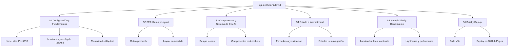

<!-- prettier-ignore-start -->

## 📋 Tabla de contenidos
{: .no_toc }
- TOC
{:toc}

<!-- prettier-ignore-end -->

# Hoja de Ruta de Enseñanza de Tailwind CSS

## Mapa conceptual

```mermaid
graph TD
  A[Hoja de Ruta Tailwind] --> B[S1 Configuración y Fundamentos]
  A --> C[S2 SPA: Ruteo y Layout]
  A --> D[S3 Componentes y Sistema de Diseño]
  A --> E[S4 Estado e Interactividad]
  A --> F[S5 Accesibilidad y Rendimiento]
  A --> G[S6 Build y Deploy]

  B --> B1[Node, Vite, PostCSS]
  B --> B2[Instalación y config de Tailwind]
  B --> B3[Mentalidad utility‑first]
  C --> C1[Ruteo por hash]
  C --> C2[Layout compartido]
  D --> D1[Design tokens]
  D --> D2[Componentes reutilizables]
  E --> E1[Formularios y validación]
  E --> E2[Estados de navegación]
  F --> F1[Landmarks, foco, contraste]
  F --> F2[Lighthouse y performance]
  G --> G1[Build Vite]
  G --> G2[Deploy en GitHub Pages]
```

- **S1 — Configuración y Fundamentos:**

  - Instalar y configurar Node y Vite. Explicar **npm** (gestor de paquetes de Node) y **npx** (ejecutor de paquetes incluido desde npm v5.2+)[freecodecamp.org](https://www.freecodecamp.org/news/npm-vs-npx-whats-the-difference/#:~:text=npm%20,packages%20both%20globally%20and%20locally)[freecodecamp.org](https://www.freecodecamp.org/news/npm-vs-npx-whats-the-difference/#:~:text=npx%20the%20package%20runner). Usar `npm create vite@latest` para crear el proyecto y `npx vite` para levantar el servidor de desarrollo[developer.mozilla.org](https://developer.mozilla.org/en-US/docs/Learn_web_development/Extensions/Client-side_tools/Package_management#:~:text=bash).

  - Diferenciar herramientas de build vs. archivos estáticos: el comando `build` de Vite empaqueta a `dist/`[vite.dev](https://vite.dev/guide/static-deploy#:~:text=By%20default%2C%20the%20build%20output,any%20of%20your%20preferred%20platforms), eliminando características solo de desarrollo (HMR) para producción[developer.mozilla.org](https://developer.mozilla.org/en-US/docs/Learn_web_development/Extensions/Client-side_tools/Package_management#:~:text=However%2C%20this%20code%20is%20not,will%20just%20bloat%20your%20site). Ese `dist/` (o `outDir` configurado) es lo que se despliega (p. ej. GitHub Pages).

  - Añadir Tailwind CSS: `npm install -D tailwindcss postcss autoprefixer`, crear `tailwind.config.js` y `postcss.config.js`, e incluir `@tailwind base; @tailwind components; @tailwind utilities;` en tu CSS principal[blog.logrocket.com](https://blog.logrocket.com/top-utility-first-css-frameworks/#:~:text=Tailwind%20CSS)[freecodecamp.org](https://www.freecodecamp.org/news/what-is-postcss/#:~:text=PostCSS%20is%20also%20used%20by,which%20is%20a%20PostCSS%20plugin). Explicar que Tailwind es un plugin de PostCSS y que PostCSS transforma CSS mediante plugins[freecodecamp.org](https://www.freecodecamp.org/news/what-is-postcss/#:~:text=PostCSS%20is%20a%20Node,your%20styles%20using%20JavaScript%20plugins)[freecodecamp.org](https://www.freecodecamp.org/news/what-is-postcss/#:~:text=PostCSS%20is%20also%20used%20by,which%20is%20a%20PostCSS%20plugin).

  - Introducir **utility‑first CSS**: clases como `.bg-blue` aplican un único estilo (p. ej. `background-color: blue`)[css-irl.info](https://css-irl.info/a-year-of-utility-classes/#:~:text=Utility%20classes%20are%20CSS%20class,established). Breve historia de CSS atómico: BASSCSS (2013) y Tachyons (2014) ofrecieron utilidades[andreipfeiffer.dev](https://andreipfeiffer.dev/blog/2022/scalable-css-evolution/part6-atomic-css#:~:text=BASSCSS); Tailwind (2017) popularizó el enfoque con nombres claros y variantes responsive[andreipfeiffer.dev](https://andreipfeiffer.dev/blog/2022/scalable-css-evolution/part6-atomic-css#:~:text=Tailwind)[en.wikipedia.org](https://en.wikipedia.org/wiki/Tailwind_CSS#:~:text=Tailwind%20CSS%20is%20an%20open,6). El procesado de Tailwind elimina clases no utilizadas en producción para mantener builds pequeñas[vite.dev](https://vite.dev/guide/assets#:~:text=imgUrl).

  - **Práctica con utilidades Tailwind:** experimentar con espaciado (`p-4`, `m-2`), tipografía (`text-lg`), layout (`flex`, `grid`), colores (`text-white`, `bg-red-500`) y prefijos responsive (p. ej. `md:`) en una página hero/CTA.

  - **Assets estáticos:** demostrar importación de imágenes u otros ficheros. `import logoUrl from './logo.svg'` devuelve una URL para ``[vite.dev](https://vite.dev/guide/assets#:~:text=imgUrl). Vite optimiza y añade hash en `dist/`.

  - **Extras (opcional):** Añadir TypeScript (`npm i -D typescript` + `tsconfig.json` y renombrar `.js`→`.ts`)[typescriptlang.org](https://www.typescriptlang.org/docs/handbook/migrating-from-javascript.html#:~:text=TypeScript%20doesn%E2%80%99t%20exist%20in%20a,We%20assume%20you%E2%80%99ve%20read)[kvz.io](https://kvz.io/blog/js-to-ts.html#:~:text=Folks%20on%20the%20internet%20say%3A,then%20turn%20them%20into%20errors). **ESLint** y **Prettier** para calidad[prettier.io](https://prettier.io/docs/integrating-with-linters#:~:text=Linters%20usually%20contain%20not%20only,Linters). **Vitest** como test runner de Vite[vitest.dev](https://vitest.dev/guide/#:~:text=Vitest%20%28pronounced%20as%20,testing%20framework%20powered%20by%20Vite).

  - **Entregable:** Landing responsive (sección hero + CTA) con utilidades Tailwind.

  - **Esfuerzo estimado:** ~3–4 horas.

### S1 — Paso a paso (Mobile‑First, Utility‑First)

1. Instala Node LTS (20+). Crea proyecto: `npm create vite@latest` → plantilla vanilla → `npm i` → `npm run dev`.
2. Instala Tailwind y tooling: `npm i -D tailwindcss postcss autoprefixer` → `npx tailwindcss init -p`.
3. Configura `content` en `tailwind.config.js` con tus rutas HTML/JS.
4. En `main.css` añade: `@tailwind base; @tailwind components; @tailwind utilities;`.
5. Construye hero + CTA con utilidades de espaciado, tipografía y layout. Base móvil; usa prefijos (`sm: md: lg:`) para mejora progresiva.
6. Commit: "S1: Vite + Tailwind; hero/CTA mobile‑first".

Preguntas críticas del Atelier (S1):

- Exploración: ¿Qué aprendiste al componer con utilidades frente a CSS a medida?
- Reflexión: ¿Qué decisiones mejoraron la legibilidad o la perjudicaron?
- Conceptualización: ¿Cómo se relaciona utility‑first con tokens y sistemas de diseño?
- Producción: ¿Qué comunica con claridad tu mensaje de commit?
- Exhibición: ¿Cómo demostrarás el comportamiento mobile‑first en vivo?

## S2 — SPA: Ruteo y Layout

- **SPA vs MPA:** Una **SPA** carga una única página HTML y usa JS para actualizar contenido y rutas[cleancommit.io](https://cleancommit.io/blog/spa-vs-mpa-which-is-the-king/#:~:text=There%20are%20two%20main%20architecture,as%20blogs%20or%20news%20websites)[developer.mozilla.org](https://developer.mozilla.org/en-US/docs/Glossary/CSR#:~:text=Client,together%20in%20the%20same%20application). Ventajas UX (sin recarga completa) con costes de SEO/tiempo inicial. Las MPA obtienen un nuevo HTML por navegación. Normalmente las SPA usan CSR[developer.mozilla.org](https://developer.mozilla.org/en-US/docs/Glossary/CSR#:~:text=Client,together%20in%20the%20same%20application)[developer.mozilla.org](https://developer.mozilla.org/en-US/docs/Glossary/CSR#:~:text=Benefits%20of%20CSR%20include%3A).

- **Ruteo:** Implementar **router por hash**. Usar `window.onhashchange`/evento `hashchange` para detectar cambios en `window.location.hash`[stackoverflow.com](https://stackoverflow.com/questions/54231533/how-to-create-a-vanilla-js-routing-for-spa#:~:text=The%20strategy%20is%20to%20add,and%20inject%20the%20relevant%20content). Enlaces `<a href="/#/about">About</a>` no recargan; se parsea `location.hash` para renderizar vistas. Ejemplo de JS que intercambia `innerHTML` según la ruta.

- **Layout y componentes:** Crear **Navbar** y **Footer** compartidos (HTML común o plantillas JS). Navbar con hashes (`#/, #/projects`, etc.). Contenedor principal (`<main>` o `
`). Enfatizar **accesibilidad**: elementos semánticos, textos de enlace adecuados y estados de foco (p. ej. `focus-visible`).

- **Entregable:** SPA básica de dos vistas (“Home” y “About”) con Tailwind. Navegación sin recarga completa; hash actualiza URL. Layout responsive.

- **Esfuerzo estimado:** ~2–3 horas.

### S2 — Paso a paso (Ruteo, Layout compartido)

1. Crea `index.html` con `<nav>`, `<main id="app">`, `<footer>`; estiliza con utilidades.
2. Añade `router.js`: en `hashchange` renderiza en `#app` según `location.hash`.
3. Implementa dos vistas: Home y About. Asegura estados de foco visibles (`focus-visible`).
4. Añade skip‑link y landmarks para accesibilidad.
5. Commit: "S2: Router por hash + layout compartido, nav accesible".

Preguntas críticas del Atelier (S2):

- Exploración: ¿Qué UX mejora al evitar recargas completas?
- Reflexión: ¿Qué compromisos de accesibilidad introduce CSR?
- Conceptualización: ¿Cómo moldean las rutas la arquitectura de la información?
- Producción: ¿Es tu router pequeño, claro y documentado?
- Exhibición: ¿Cómo demostrarás cambios de ruta y manejo del foco?

## S3 — Componentes y Sistema de Diseño

- Tokens: extiende el tema de Tailwind (o usa variables CSS) para colores, espaciado y radios.
- Componentes reutilizables: Botón, Tarjeta, Sección con utilidades (y opcional `@apply`).
- Grid de proyectos: espaciado consistente, jerarquía tipográfica y respuesta responsive.

### S3 — Paso a paso

1. Define un set mínimo de tokens en `tailwind.config.js` (`theme.extend.colors`, spacing, borderRadius).
2. Construye patrones `btn` y `card` con utilidades; cubre hover/focus/disabled.
3. Compón un grid responsive (`grid grid-cols-1 sm:grid-cols-2 lg:grid-cols-3 gap-6`).
4. Commit: "S3: Tokens + componentes reutilizables (botones, tarjetas)".

Preguntas (S3): ¿Qué utilidades expresan mejor tus tokens? ¿Qué hace a un componente reutilizable y accesible?

## S4 — Estado e Interactividad

- Añadir formulario con validación en cliente; errores accesibles.
- Mejorar navegación: estados activos, `aria-current`, reduced motion.
- Estado ligero en JS para tabs o menú colapsable.

### S4 — Paso a paso

1. Maqueta el formulario con etiquetas, descripciones y contenedores de error.
2. Implementa validación; anuncia errores con `aria-live` y asociación a inputs.
3. Aplica estilos activos de navegación y soporte de teclado; respeta `prefers-reduced-motion`.
4. Commit: "S4: Validación de formulario + nav interactiva (accesible)".

Preguntas (S4): ¿Dónde aporta valor la interactividad y dónde es ruido? ¿Cómo respetas sensibilidad al movimiento?

## S5 — Accesibilidad y Rendimiento

- Auditar landmarks, encabezados, contraste y orden de foco.
- Optimizar imágenes y fuentes; prioriza system fonts cuando sea posible.
- Ejecutar Lighthouse y corregir problemas de alto impacto.

### S5 — Paso a paso

1. Añade skip‑link; verifica `<main>`, `<nav>` y jerarquía de encabezados.
2. Comprueba contraste; ajusta tokens para cumplir WCAG AA.
3. Optimiza imágenes (tamaños/formatos); ejecuta Lighthouse y registra mejoras.
4. Commit: "S5: Pase de a11y + performance; tokens ajustados".

Preguntas (S5): ¿A quién excluyen tus decisiones actuales? ¿Qué es “suficiente” rendimiento para tu audiencia?

## S6 — Build y Deploy

- Build de producción con Vite; verifica `dist/`.
- Deploy en GitHub Pages; configura `base` si usas subruta.
- Documenta el despliegue en README.

### S6 — Paso a paso

1. Configura `vite.config` con `base: '/nombre-del-repo/'` si aplica.
2. `npm run build` y prueba `dist/` localmente o con servidor estático.
3. Publica en GitHub Pages; verifica rutas y assets.
4. Commit: "S6: Build de producción + notas de despliegue".

Preguntas (S6): ¿Qué cambia entre dev y prod? ¿Qué historia cuenta tu sitio en vivo?

## Referencias

- MDN — Package management basics: https://developer.mozilla.org/en-US/docs/Learn_web_development/Extensions/Client-side_tools/Package_management
- Vite — Deploying a static site: https://vite.dev/guide/static-deploy
- Vite — Assets handling: https://vite.dev/guide/assets
- Tailwind CSS — Instalación y configuración: https://tailwindcss.com/docs/installation
- LogRocket — Utility‑first CSS: https://blog.logrocket.com/top-utility-first-css-frameworks/
- CSS‑IRL — Un año de utility classes: https://css-irl.info/a-year-of-utility-classes/
- FreeCodeCamp — ¿Qué es PostCSS?: https://www.freecodecamp.org/news/what-is-postcss/
- TypeScript — Migrar desde JavaScript: https://www.typescriptlang.org/docs/handbook/migrating-from-javascript.html
- Vitest — Guía: https://vitest.dev/guide/
- MDN — CSR (Client‑side rendering): https://developer.mozilla.org/en-US/docs/Glossary/CSR
- CleanCommit — SPA vs MPA: https://cleancommit.io/blog/spa-vs-mpa-which-is-the-king/
- StackOverflow — Ruteo por hash en JS vanilla: https://stackoverflow.com/questions/54231533/how-to-create-a-vanilla-js-routing-for-spa